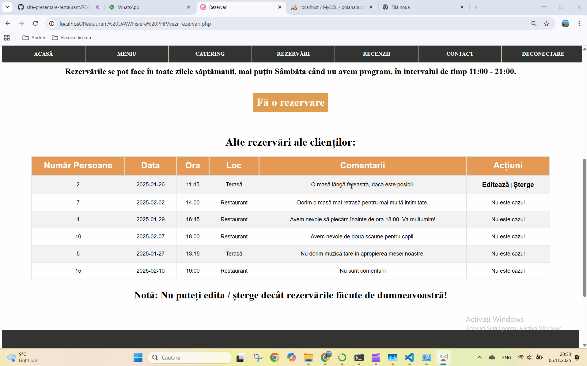

# 🍽️ Site Web de Prezentare Restaurant

> **Proiect realizat în PHP, HTML, și CSS (fără framework-uri)**
> Include funcționalități pentru utilizatori și administratori și este conectat la o bază de date **MySQL**

---

## 🧾 Descriere:
Acesta este un site web de prezentare a unui restaurant, creat cu **PHP**, **HTML** și **CSS**, fără a folosi vreun framework.
Site-ul include funcționalități pentru **utilizatori** și **administratori**, și este conectat la o bază de date **MySQL**.

## ⚙️ Funcționalități principale

✅ Înregistrare utilizatori  
✅ Autentificare utilizatori (mod **user normal** sau mod **admin**)  
✅ Vizualizare meniu  
✅ Creare / Editare / Ștergere **Recenzii** (doar ale utilizatorului logat)  
✅ Creare / Editare / Ștergere **Rezervări**  

Administratorul poate:
- Șterge **toate rezervările** sau **recenziile**
- Adăuga **preparate noi** în meniu

>  ℹ️  Nu i-am oferit administratorului posibilitatea de a adăuga sau edita recenziile clienților - consider că nu ar fi etic.

Toate acestea printr-o interfață **simplă și intuitivă**, care permite executarea celor 4 operații de bază astupra bazei de date:
> **Create - Read - Update - Delete (CRUD)**

## 🗄️ Structura bazei de date (MySQL)
1️⃣ **utilizatori** (id_utilizator, nume, prenume, username, parola, email, admin)  
2️⃣ **meniu** (id_preparat, nume_preparat, descriere, gramaj, pret, categorie)  
3️⃣ **recenzii** (id_recenzie, id_utilizator, nota_recenzie, comentariu_recenzie, data_recenzie)  
4️⃣ **rezervari** (id_rezervare, id_utilizator, numar_persoane, data, ora, loc, telefon, comentarii)  

## 🧩 Instalare și rulare
1. Clonează repo-ul (git clone https://github.com/andrei-vasile-dev/site-prezentare-restaurant.git)
2. Configurează baza de date (creează o bază de date MySQL, importă fișierul poianabucatelor.sql și actualizează fișierul config.php cu datele tale de acces la MySQL)
3. Rulează site-ul -> Pune proiectul într-un server local (ex: XAMPP, WAMP, MAMP) și accesează în browser http://localhost/nume-proiect/

> Rezultatul poate fi observat în următoarele 4 filmulețe (vă rog să aveți puțină răbdare deoarece se încarcă mai greu, dar se încarcă până la urmă):

## Paginile Acasa și Meniu
  
 

## Paginile Catering, Rezervari și Recenzii
  
 

## Pagina contact
  
 

## Exemplu de adaugare a unei rezervari
  